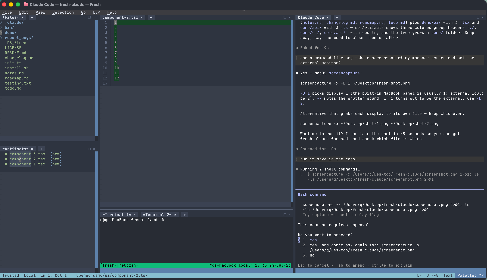

# fresh-claude

Claude Code IDE layout for [fresh](https://getfresh.dev) terminal editor. One command, full cockpit:



```
┌──────────┬──────────────────────────┬──────────────────────┐
│ File     │  editor (tabs)           │  Claude Code         │
│ Tree     │                          │  (full height)       │
├──────────┤                          │                      │
│ Artifacts├──────────────────────────┤                      │
│          │  shell                   │                      │
└──────────┴──────────────────────────┴──────────────────────┘
```

## How work

- Claude (or anything) change file → file appear in **Artifacts** panel. Grouped by dir, newest on top. `(new)` = created, `(+12)` = 12 lines changed.
- Click entry → file open in editor, changed lines **green**, jump to first change.
- Delete file → entry gone, tab gone. Revert file → entry gone. No clutter.
- No tab spam — nothing opens until you click.
- **Tree** panel: click folder = fold/unfold, click file = open. Test-runner temp churn filtered out.
- Green baseline = snapshot when fresh-claude start. Works in any dir, git not needed.

## Need

- [fresh](https://getfresh.dev) 0.4.x — `brew install sinelaw/fresh/fresh`
- [fswatch](https://github.com/emcrisostomo/fswatch) — `brew install fswatch`
- python3, git, rsync
- [Claude Code](https://claude.com/claude-code)
- Nerd Font in terminal (for folder chevrons)
- macOS, Linux, or WSL2

## Install

```sh
git clone https://github.com/mruff-aeq/fresh-claude.git
cd fresh-claude
./install.sh
```

## Run

```sh
fresh-claude                # current or default workspace
fresh-claude ~/src/myrepo   # specific workspace
```

Plain `fresh` untouched — layout only wakes when wrapper sets `FRESH_PROFILE=claude`.

## Tune

Constants at top of `~/.config/fresh/init.ts`: pane ratios (`COLUMN_RATIO`, …), colors (`DIFF_BG`, `DIR_STYLE`, `FILE_STYLE`), skipped dirs (`EXCLUDE_DIRS`). Watcher knobs in `bin/fresh-watch-open`. Code is law — read the source.

## Uninstall

```sh
rm ~/.local/bin/fresh-claude ~/.local/bin/fresh-watch-open
rm ~/.config/fresh/init.ts
rm -rf ~/.config/fresh-claude
```

## License

MIT
