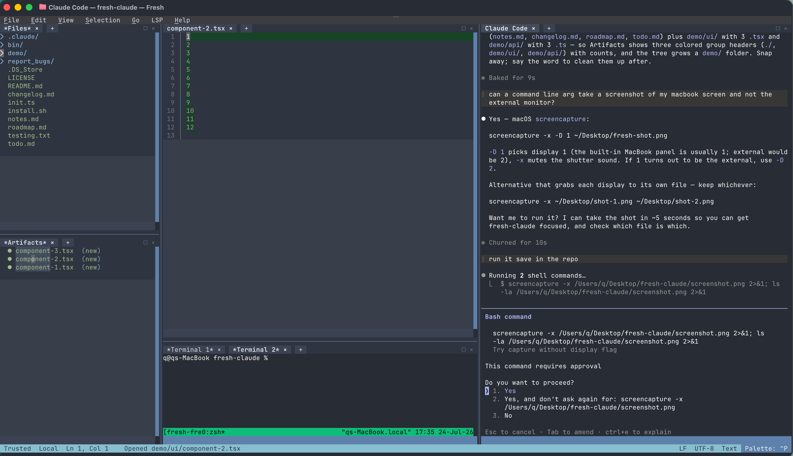

# fresh-claude

Claude Code IDE layout for [fresh](https://getfresh.dev) terminal editor. One command, full cockpit:



```
┌──────────┬──────────────────────────┬──────────────────────┐
│ Files    │  editor (tabs)           │  Claude Code         │
│          │                          │  (full height)       │
├──────────┤                          │                      │
│ Artifacts├──────────────────────────┤                      │
│          │  shell                   │                      │
└──────────┴──────────────────────────┴──────────────────────┘

Left column = one plugin dock (fresh ≥ 0.5.0): own **Files** tree on top, **Artifacts** under it. fresh's built-in File Explorer not used.
```

## How work

- Claude (or anything) change file → file appear in **Artifacts** panel. Grouped by dir, newest on top. `(new)` = created, `(+12)` = 12 lines changed.
- Click entry → file open in editor, changed lines **green**, jump to first change. Enter = open + focus editor. Scrollbar show green/red marks where changes live. Group header `▼` = fold/unfold.
- Delete file → entry gone, tab gone. Revert file → entry gone. No clutter.
- No tab spam — nothing opens until you click.
- **Files** tree: single click a file = select it (keyboard stays in the tree); double click or Enter = open + focus editor (type right away); click a folder = fold/unfold; click the `FILES` / `ARTIFACTS` header = keyboard into that tree; arrows continue from the selected row and only move the highlight. `▲ ▼` on the divider move the Files/Artifacts split (3 rows per click, remembered in `~/.config/fresh-claude/dock-ratio`). Long names **wrap** onto extra rows (no truncation), continuation rows start with a dim `↳`; hover or click lights the whole name (all its rows) while the tree fits its rows unscrolled. Changed files show green `●`. Test-runner temp churn filtered out.
- **Right-click** any row (Files or Artifacts) → context menu: **Open**, **Open with default app** (`open` / `xdg-open`), **Copy path** (absolute), **Rename…** (prompt), **Make a copy** (`name copy.ext`), **Delete…** (confirm; goes to `~/.Trash` when it exists, else `rm -r`). Dirs get the same minus Open. Arrow keys + Enter work in the menu, Esc closes.
- Green baseline = snapshot when fresh-claude start. Works in any dir, git not needed.
- Gutter bars + scrollbar marks come from the SAME snapshot diff (green = added, red = deleted). Bundled `git_gutter` plugin (diffs vs git HEAD: orange/red/green) is unloaded in this profile only, so gutter, overlay, scrollbar and Artifacts `(+N)` always agree. Plain `fresh` keeps it.
- `git checkout` / `pull` / `stash` / `reset` mid-session → rewritten files NOT listed; baseline moves with them, so only edits after the switch show. Needs the repo's reflog (plain dirs unaffected).

## Need

- [fresh](https://getfresh.dev) ≥ 0.5.0 — `brew install fresh-editor`
- [fswatch](https://github.com/emcrisostomo/fswatch) — `brew install fswatch`
- python3, git, rsync
- [Claude Code](https://claude.com/claude-code)
- macOS, Linux, or WSL2

## Install

```sh
git clone https://github.com/mruff-aeq/fresh-claude.git
cd fresh-claude
./install.sh
```

## Run

```sh
fresh-claude                # current or default workspace
fresh-claude ~/src/myrepo   # specific workspace
```

Plain `fresh` untouched — layout only wakes when wrapper sets `FRESH_PROFILE=claude`.

## Tune

Constants at top of `~/.config/fresh/init.ts`: pane ratios (`CLAUDE_RATIO`, `SHELL_RATIO`, `FILES_RATIO` = Files/Artifacts split), colors (`DIFF_BG`, `DIR_STYLE`, `FILE_STYLE`, `ART_DOT`), skipped dirs (`EXCLUDE_DIRS`), menu items (`MENU_ITEMS_FILE`, `MENU_ITEMS_DIR`). Dock width = `file_explorer.width` in `.fresh/config.json` when absolute (`"28"`), else 28. Snapshot skip-list in `SNAP_SCRIPT`. Watcher knobs in `bin/fresh-watch-open`. Code is law — read the source.

## Uninstall

```sh
rm ~/.local/bin/fresh-claude ~/.local/bin/fresh-watch-open
rm ~/.config/fresh/init.ts
rm -rf ~/.config/fresh-claude
```

## License

MIT
